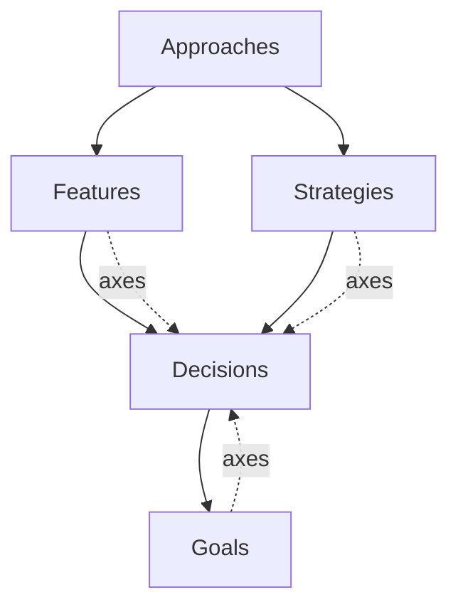

# DJ-124 — Spec Generation Re-Architecture: Decisions Before Narrative, Scout-as-Judge Convergence

> **Governing DJ:** [DJ-124](../../docs/DECISION_JOURNAL.md#dj-124) (to be added). The DJ is the authoritative design record; this plan tracks **progress against** the DJ and captures session-level implementation notes.
>
> **Status:** SUPERSEDED by DJ-135 on 2026-05-26. The Go-orchestrated council *execution* layer retires; the council *shape* this DJ defined (decisions-before-narrative, scout-as-judge convergence, the agent set, the unified import flow) carries forward verbatim as the activity playbook at `internal/scaffold/plans/spec_refinement.md`. See DJ-135 resolved-question 1: "the council shape is right; the execution layer is what's brittle." Historical: Phases 1-8 landed in commits `9cc3595` → `73002ae`; the WorkflowExecutor those phases shipped retired in DJ-135 Phase 5.
> **Surface area:** schema changes (small) + workflow re-architecture (substantial) + scaffold prompt rewrites + import flow unification.
> **Discipline (per memory):** tests → design pause in chat → code; mid-impl failures trigger design judgment, not test patching. Each phase verifies independently before moving on. **Prompt edits walk [docs/agent-conventions.md](../../docs/agent-conventions.md) end-to-end before drafting** per [[feedback-agent-conventions-checklist-first]].

## Spec graph (corrected)

```text
Goal → Decision → (Feature | Strategy) → Approach
```

In Mermaid form, where solid arrows are "refers to" relationships and dotted arrows show where axes that drive decisions come from:



The reference direction is the inverse of the authoring/flow order. Approaches reference features/strategies; features/strategies reference decisions; decisions reference goals (via existing `Citation.Kind: goals`). Authoring order is forced by this: a node can't reference what doesn't exist yet, so goals → decisions → features/strategies → approaches.

The dotted axis-flow says: axes that need decisions can be surfaced from goals, features, or strategies. New imported content (PRD-driven features, new strategies, refined goals) surfaces axes that may need new decisions; the scout's job is to detect this.

## Why this plan exists

DJ-123's winplan re-run ([trace](file:///Users/chetan/projects/winplan/.locutus/sessions/20260515/0006/29-5135bd/)) failed to converge in 5 iterations. The empirical signature was the **iter-3 → iter-4 explosion**: iter-3 had 3 open dimensions; iter-4 had 5 entirely new ones; iter-5 saw the same 5 with renamed framings. Diagnosis surfaced two coupled root causes:

1. **Decisions and narrative are coupled in elaborator output.** Each elaborator authors both at once; revising narrative re-litigates decisions; revising decisions invalidates narrative; the loop never settles.
2. **Within-iteration parallel fanout has no cross-visibility.** N parallel revise-elaborators each see iter-(N-1) state but not each other's iter-N work, so they independently re-pick on already-stable axes.

DJ-123's in-flight search infrastructure is structurally correct but cannot solve either root cause — it's a coordination tool for an architecture that never coordinates at the right phase boundary. The fix is structural: **decisions become first-class outputs of their own phase; features/strategies reference decisions by ID; the scout is the unified completeness judge that drives convergence and analyzes imported content the same way it analyzes goals.**

## Reference state (before adoption)

- **`spec.Decision`** ([internal/spec/types.go](../../internal/spec/types.go)) is a top-level kind with rationale, alternatives, citations, provenance. Already first-class structurally; its position in the generation workflow changes.
- **`spec.Alternative`** ([internal/spec/types.go](../../internal/spec/types.go)) carries `Name`, `Rationale`, `RejectedBecause` — no citations field on alternatives today.
- **`spec.Citation.Kind`** ([internal/spec/types.go](../../internal/spec/types.go)) enum: `goals`, `doc`, `best_practice`, `spec_node`, `scout_brief`. No `web` kind for grounded research output.
- **`RawFeatureProposal.Decisions []InlineDecisionProposal`** and **`RawStrategyProposal.Decisions []InlineDecisionProposal`** ([internal/agent/raw_proposal.go](../../internal/agent/raw_proposal.go)) carry inline decision objects. DJ-105 made these required (`minItems=1`); DJ-124 changes the field type from inline objects to ID references.
- **`spec.Feature`** and **`spec.Strategy`** ([internal/spec/types.go](../../internal/spec/types.go)) — today do NOT carry a structural `Decisions []string` reference list on the persisted shape. That field is added.
- **`spec_reconciler`** ([internal/scaffold/agents/spec_reconciler.md](../../internal/scaffold/agents/spec_reconciler.md)) deduplicates inline decisions across siblings. Job becomes much smaller — feature/strategy decision references don't dedupe; new decisions per axis are isolated by axis.
- **Convergence loop** ([internal/agent/workflow_spec_generation.go](../../internal/agent/workflow_spec_generation.go)) runs scout → outline → elaborate → reconcile → critics → finding clusterer → gate. DJ-122's graph-mutation executor stays; the loop body changes.
- **`locutus import <source>`** ([cmd/import.go](../../cmd/import.go)) has its own admission flow with inline-decisions and prompt-based triage. Unifies with the standard workflow under DJ-124.
- **Spec-graph topology comment in CLAUDE.md** says `Goal → (Feature | Strategy) → Decision`. Wrong — decisions are upstream of features/strategies. CLAUDE.md gets corrected to the linear chain above.

## Resolved design questions

Recorded in chat 2026-05-15 / 2026-05-16; settled before this plan went to implementation.

1. **Axes are ephemeral; not a new spec kind.** Persisting open axes adds lifecycle complexity (proposed → answered → superseded → deprecated) with no consumer demanding it. Decided axes ride on `Decision.Axes []string`. Open axes live only in the scout's per-iteration output; cross-run continuity for decided axes comes from set-membership against `Decision.Axes`.

2. **Decisions carry `Axes []string`, not `Axis string`.** Multiple decisions can intentionally share an axis category (auth-for-staff vs auth-for-end-users). The `Axes []string` shape supports this naturally; "covered axes" = `unique(decisions.flatMap(d -> d.Axes))`.

3. **Open axis = no covering decision.** An axis is closed once at least one decision tagged with its ID exists in the graph. The scout's `axes_open[]` output surfaces only uncovered axes; closed axes are implicit via the decisions covering them. Convergence is `axes_open == []` AND no critic findings.

4. **Scout is the unified gap analyzer + convergence judge.** The work today's scout does at session start (domain pattern-matching, axis identification) is the same work today's gate does at convergence-check time (is the proposal complete?). Collapsing them into one role removes duplication and stabilizes axis identifiers across iterations.

5. **Scout names axes; does not enumerate options.** Per-axis option research happens inside the decision-elaborator that owns the axis. The scout's job is to recognize project shape and surface what needs deciding; the decision-elaborator's job is to research and pick. Separating these keeps each role focused.

6. **Scout maps surfaced axes to existing decisions in the same pass.** For each axis it identifies, the scout checks whether an existing decision covers it. Covered axes don't appear in `axes_open`; their decisions are referenced from any new feature/strategy node the scout emits.

7. **Scout is grounded for domain understanding; decision-elaborators are grounded for per-axis option research.** Both pinned to strong tier. Narrative-elaborators stay balanced tier and ungrounded.

8. **Decisions cite both chosen path and rejected alternatives.** `spec.Alternative.Citations []Citation` extends today's schema. Citation kind `web` is added for grounded-research evidence the decision-elaborator gathered itself.

9. **Decisions carry `SurfacedBy []string`** back-references to the goal / feature / strategy nodes that surfaced the axis. Set at decision-creation time by the scout-controlled dispatch; supports the future explain/justify verbs that walk the graph both directions.

10. **`Feature.Decisions []string` and `Strategy.Decisions []string` with `minItems=1`.** Every feature/strategy structurally anchored in at least one decision. References are scout-determined (not mechanically every-foundational-decision); the scout's analysis is what produces the meaningful reference list. The dangling-reference integrity check applies to these references.

11. **Phase 2 narrative-elaborators dispatch conditionally.** Workflow controller computes `affected = features_referencing(changed_decisions) ∪ nodes_named_in(findings) ∪ new_nodes_from_scout` and dispatches narrative re-elaboration only for the affected set. Unaffected nodes keep their prior body.

12. **`locutus import` becomes a thin entry point into the standard workflow.** Imported content (PRD markdown, etc.) joins goals + existing graph as input to the scout. The loop handles everything from there: scout analyzes, identifies new feature(s)/strategy(ies), maps axes to existing decisions, surfaces open axes, Phase 1 commits new decisions, Phase 2 authors the new node(s) with references, critics run, loop converges. No separate import logic.

13. **In-flight search (DJ-123) becomes defense-in-depth, not the convergence mechanism.** Infrastructure stays; role downgrades. Phase 2 narrative-elaborators can still query in-flight `spec_search` to check what siblings have committed, but cross-iteration alignment is no longer load-bearing on the search tool — it's load-bearing on Phase 1's per-axis decision discipline.

14. **No deferred-decision escape pattern (retires DJ-105's `Defer architectural commitment` workaround).** Today's elaborators could emit a placeholder decision when they couldn't make a real one. In the new shape, the scout decides whether an axis is decidable now; if not, it stays in `axes_open` across iterations and the loop doesn't converge. User intervention (more context, goal change, or explicit `locutus refine` on the specific axis) closes it. No schema-pressure to invent placeholder decisions.

## Phase 1 — Schema changes

**Goal:** schema field additions, type changes, and the `Citation.Kind` enum extension. All jsonschema-tagged per CLAUDE.md rule.

**Files expected to change:**

- [internal/spec/types.go](../../internal/spec/types.go):
  - `Decision.Axes []string` with `jsonschema:"description=Stable slug-IDs of the foundational axes this decision answers. Examples: [\"auth-provider\"], [\"compute-platform\",\"deployment-target\"]. Multiple axes mean the decision spans them. Names match what the scout enumerated.,minItems=1"`.
  - `Decision.SurfacedBy []string` with `jsonschema:"description=Spec node IDs (goal / feature / strategy) that surfaced the axis this decision answers. Populated by the scout's dispatch at decision-creation time. Empty for legacy decisions authored before DJ-124."`.
  - `Alternative.Citations []Citation` with `jsonschema:"description=Citations backing the rejected_because reasoning for this alternative — evidence that this option was considered seriously and the reason it lost is grounded.,minItems=1"`.
  - `Citation.Kind` enum extended with `web` — `jsonschema:"description=...,enum=goals,enum=doc,enum=best_practice,enum=spec_node,enum=scout_brief,enum=web"`.
  - `Feature.Decisions []string` with `jsonschema:"description=Decision IDs this feature depends on. The scout determines membership during gap analysis; every entry must reference a decision present in the graph at integrity-check time.,minItems=1"`.
  - `Strategy.Decisions []string` with the same shape.
- [internal/agent/raw_proposal.go](../../internal/agent/raw_proposal.go):
  - `RawFeatureProposal.Decisions` changes type from `[]InlineDecisionProposal` to `[]string` (decision IDs).
  - `RawStrategyProposal.Decisions` same change.
  - `InlineDecisionProposal` struct removed entirely (no consumer remains).
- New `RawDecisionProposal` struct in [internal/agent/raw_proposal.go](../../internal/agent/raw_proposal.go) — the per-axis output shape of Phase 1's decision-elaborator. Carries the full Decision content (title, body, rationale, alternatives, citations, axes, surfaced_by) for Phase 1 to author.
- [internal/scaffold/scaffold_test.go](../../internal/scaffold/scaffold_test.go) — `TestElaboratorPromptsForbidDecisionsOmission` (DJ-105) gets removed; the field it guarded no longer carries inline decisions.
- [internal/agent/raw_proposal_schema_test.go](../../internal/agent/raw_proposal_schema_test.go) — `TestRawProposalSchemasRequireDecisions` rewritten to assert the new shape: `decisions` field is `[]string`, `minItems=1`. Companion `TestDecisionSchemaCarriesAxesAndSurfacedBy` confirms both fields are present in the registered schema with the right descriptions.

**Verification:** `go build ./... && go vet ./... && go test ./internal/spec/... ./internal/agent/... -count=1 -race`.

**Estimated:** 2-3 hours (slightly more than originally because of the field-type change and the back-reference field).

## Phase 2 — Scout role redesign (gap analyzer + judge + decision-mapper)

**Goal:** rewrite the scout agent prompt so it produces structured `axes_open[]` + `new_nodes[].decisions[]` output, maps surfaced axes to existing decisions, and runs every iteration consuming its prior output for stability.

**Files expected to change:**

- [internal/scaffold/agents/spec_scout.md](../../internal/scaffold/agents/spec_scout.md) — rewritten. New role: **gap analyzer + completeness judge + decision-mapper**. Output schema becomes `ScoutBrief` extended with:
  - `axes_open: [{id, description, source_evidence[]}]` — only uncovered axes.
  - `new_nodes: [{kind, id, decisions[]}]` — new features/strategies the scout identified from imported content or goal-change analysis, with `decisions[]` pre-populated from existing decisions covering their axes.
  - `converged: bool` — true when both `axes_open` and the iteration's `findings` are empty.
  - Existing `domain_read`, `technology_options`, `implicit_assumptions`, `watch_outs` fields stay (still useful inputs for decision-elaborators) but are re-framed as supporting content for axis identification, not as commitment material.
- New schema definition for the extended `ScoutBrief` shape with `jsonschema` tags per CLAUDE.md rule. Existing `ScoutBrief` schema in `internal/agent/scout.go` (or wherever it lives) gets the new fields added with descriptive tags.
- [internal/agent/spec_search_metrics.go](../../internal/agent/spec_search_metrics.go) — instrumentation aggregate extends to count scout iterations + converged-rate per session.

**Process discipline (mandatory):** walk [docs/agent-conventions.md](../../docs/agent-conventions.md) end-to-end before drafting the new scout prompt. Audit the draft against each numbered anti-pattern after writing.

**Tests:**

- `TestScoutEmitsAxesOpen` — fixture goals + empty existing graph, scout returns axes_open with at least the expected core axes (frontend, hosting, auth, tenancy, etc. for the WinPlan-style fixture).
- `TestScoutMapsAxesToExistingDecisions` — fixture with some existing decisions; scout's `new_nodes[].decisions[]` references the existing decisions on covered axes; `axes_open[]` contains only uncovered axes.
- `TestScoutReusesPriorAxesWhenStable` — second call with prior_scout_output as input and unchanged state; axes_open should match prior verbatim (model behavior; tested with mock + asserted against expected output).
- `TestScoutConvergedWhenAllAxesClosed` — scout receives state with decisions covering every axis from prior output; returns `converged: true, axes_open: []`.
- `TestScoutSurfacesNewNodesFromImportedContent` — fixture with imported PRD content (dashboard markdown) and existing graph; scout identifies the new feature node and pre-populates its decisions from existing covered axes.

**Verification:** `go test ./internal/agent/... ./internal/scaffold/... -count=1 -race`.

**Estimated:** 4-5 hours (prompt drafting + agent-conventions audit + the additional mapping/new-node analysis the scout has to perform).

## Phase 3 — Decision-elaborator (new agent)

**Goal:** new agent type that takes one axis + its surfacing-node context and produces one decision with grounded research, citations on chosen path and each rejected alternative, and the back-reference set.

**Files expected to change:**

- New [internal/scaffold/agents/spec_decision_elaborator.md](../../internal/scaffold/agents/spec_decision_elaborator.md). Frontmatter: `output_schema: RawDecisionProposal`, `models: [strong tier across providers]`, `grounding: true`, `thinking: on`. Body describes per-axis research → pick → justify pattern with citation discipline. The literal-sentinel pattern from `justify_researcher.md` ports here for cases where grounded search returns no usable evidence.
- [internal/agent/raw_proposal.go](../../internal/agent/raw_proposal.go) — `RawDecisionProposal` includes title, body, rationale, alternatives (each with citations), provenance citations, axes (mirrors input axis ID), surfaced_by (mirrors input surfacing-node IDs).
- New tests: `TestDecisionElaboratorEmitsChosenAndRejectedCitations` (decision must carry citations on both paths), `TestDecisionElaboratorTagsWithAxis` (decision.Axes contains the input axis ID), `TestDecisionElaboratorRecordsSurfacedBy` (decision.SurfacedBy contains the input surfacing-node IDs).

**Process discipline:** same agent-conventions walk as Phase 2. Citation discipline (real grounded evidence; literal-sentinel pattern when search returns nothing) borrows from the existing `justify_researcher.md` lessons. Particular care needed because alternatives' rejected_because is the field most prone to fabricated reasoning ("we considered Auth0 but [made-up cost claim]").

**Verification:** `go test ./internal/agent/... ./internal/scaffold/... -count=1 -race`. Eval test (build-tagged) verifies the agent produces real citations against a fixture web-search corpus.

**Estimated:** 4-5 hours.

## Phase 4 — Narrative-elaborator (renamed from existing strategy/feature elaborator)

**Goal:** existing strategy/feature elaborators shrink. They no longer author decisions inline; they consume settled decisions by ID and write feature/strategy bodies that reference them. Stay balanced-tier and ungrounded.

**Files expected to change:**

- [internal/scaffold/agents/spec_strategy_elaborator.md](../../internal/scaffold/agents/spec_strategy_elaborator.md) and [spec_feature_elaborator.md](../../internal/scaffold/agents/spec_feature_elaborator.md) — rewritten. New job: write narrative referencing settled decisions. The "decisions" sections of the prompt body get replaced with a "referencing decisions" section. The output schema reflects the Phase 1 type change (decisions are `[]string` references).
- Frontmatter unchanged otherwise; tier (balanced) and grounding (off) stay as today's elaborators.

**Process discipline:** walk agent-conventions before drafting; audit after.

**Tests:**

- `TestNarrativeElaboratorReferencesDecisionsByID` — output's `decisions[]` only contains IDs from the input decision set.
- `TestNarrativeElaboratorDoesNotAuthorDecisions` — output contains no inline decision objects; all decision references are pre-existing IDs.

**Verification:** existing `TestSpecGenerationWorkflow*` tests need updating to match new shape. Mock executors that returned full elaborator output now return decision-free narrative.

**Estimated:** 2-3 hours.

## Phase 5 — Workflow re-architecture

**Goal:** rewire `SpecGenerationWorkflow` from `scout → outline → elaborate → reconcile → critics → clusterer → gate` to `scout → decisions → narrative → critics`. Conditional Phase 2 dispatch via controller logic. Unified handling of refine vs import via a shared input set.

**Files expected to change:**

- [internal/agent/workflow_spec_generation.go](../../internal/agent/workflow_spec_generation.go) — `NewSpecGenerationWorkflow` rewritten. Uses DJ-122's graph-mutation executor; spawner nodes drive per-axis decision-elaborator dispatch (one per `axes_open` entry) and per-affected-node narrative-elaborator dispatch.
- New helper: `computeAffectedNodes(prior_decisions, new_decisions, findings, new_nodes) []string` returns the set of feature/strategy IDs that need narrative re-elaboration. Set is: nodes referencing any changed decision ∪ nodes named in findings ∪ new nodes from the scout's `new_nodes[]` output.
- [internal/agent/state.go](../../internal/agent/state.go) — `PlanningState` extended with:
  - `priorScoutOutput *ScoutBrief` (json:"-") for cross-iteration scout chaining.
  - `imported []ImportedContent` (json:"-") for content from `locutus import` admitted into the workflow's input set.
  - `axesOpen []OpenAxis` tracks the current iteration's open list (used by the controller for dispatch).
- `mergeDecisions(s *PlanningState, results []RoundResult)` — new merge function for Phase 1 outputs. Adds the new decisions to `state.RawProposal` (now decision-only at the top level); updates any pending `new_nodes[].decisions[]` to append the newly-created decision IDs (the closed-axis pre-population covered the existing ones; this appends the just-now-decided ones).
- `mergeNarrative(s *PlanningState, results []RoundResult)` — new merge function for Phase 2. Updates feature/strategy bodies in `state.RawProposal`.
- Existing `mergeElaboratedFeatures`, `mergeElaboratedStrategies`, `mergeRevisedNodes` — removed. Replaced by the two new merges above.
- `mergeReconciledProposal` — scope reduced. Cross-decision dedupe is the only remaining job (rare: two decision-elaborators on different axes happening to commit overlapping content). Feature-local decision dedupe is gone (no inline decisions to dedupe).

**Tests:**

- `TestSpecGenerationWorkflowDispatchOrder` — verifies the workflow dispatches in scout → decisions → narrative → critics order.
- `TestConditionalPhase2DispatchOnlyTouchesAffected` — fixture where only 2 of 5 features reference a changed decision; Phase 2 dispatches 2 narrative-elaborators, not 5.
- `TestConvergenceWhenScoutReturnsEmptyAxes` — workflow exits with `converged: true` when scout returns empty axes_open AND no findings.
- `TestCycleDetectionWhenAxisReopens` — same axis ID appears in scout's axes_open in iter-N, gets decided, reappears in iter-(N+1)'s axes_open → cycle signal, forced exit with `terminated_by: cycle, axes_in_cycle: [...]`.
- `TestGenerateSpecExercisesNewWorkflow` — end-to-end smoke test that drives `generateSpecWithWorkflow` with a `MockExecutor` against the new shape (closes [[AUDIT-H8]] from the codebase audit).
- `TestImportFlowUnifiedWithRefineWorkflow` — `locutus import dashboard.md` runs through the same workflow as `locutus refine goals`; the imported content lands in `state.Imported` and the scout sees it on its next pass.

**Verification:** `go test ./internal/agent/... ./cmd/... -count=1 -race -skip TestCLISinkRendersAgentLifecycle`. Existing council tests that used the old workflow shape get rewritten to drive the new shape; mocks update accordingly.

**Estimated:** 7-9 hours (largest phase; touches state shape, merge functions, dispatch logic, import unification, tests).

## Phase 6 — `locutus import` unification

**Goal:** `cmd/import.go` becomes a thin entry point that admits external content into `state.Imported` and runs the standard workflow. Current admission/triage logic dissolves into the unified loop.

**Files expected to change:**

- [cmd/import.go](../../cmd/import.go) — much shorter. Reads the source file, populates `state.Imported`, calls into `generateSpecWithWorkflow` (or the equivalent entry). No separate triage agent; the scout does the triage as part of its normal pass.
- Today's import-specific scaffold files (if any) get retired. The scout's prompt covers the analysis that today's triage agent does.
- `cmd/import_test.go` updates to assert the unified flow: import a fixture file, verify the resulting graph has the new feature node with appropriate decision references.

**Verification:** `go test ./cmd/... -count=1 -race -skip TestCLISinkRendersAgentLifecycle`.

**Estimated:** 2-3 hours.

## Phase 7 — CLAUDE.md and DECISION_JOURNAL spec-graph clarification

**Goal:** correct the spec-graph statement in CLAUDE.md and any DJ that carries the old "Goal → (Feature | Strategy) → Decision" framing.

**Files expected to change:**

- [CLAUDE.md](../../CLAUDE.md) — the project-summary line becomes:

  > It maintains a persistent spec graph (`Goal → Decision → (Feature | Strategy) → Approach` — decisions inform features and strategies; approaches are the synthesis layer for coding agents over features and strategies. Axes are surfaced from goals, features, and strategies and resolved by decisions.)

  Or similar wording matching the Mermaid diagram at the top of this plan.
- [docs/DECISION_JOURNAL.md](../../docs/DECISION_JOURNAL.md) — DJ-124 entry added (per the entry draft at `.claude/plans/dj-124-entry-draft.md`). Audit DJ-068, DJ-094, DJ-105, DJ-122 for prose carrying the old graph framing; correct or add cross-reference notes.

**Verification:** human review. Grep for the old `Goal → (Feature | Strategy) → Decision` pattern and correct each occurrence.

**Estimated:** 1-2 hours.

## Phase 8 — DJ-123 disposition

**Goal:** add a DJ-123 epilogue (drafted at `.claude/plans/dj-124-entry-draft.md`) recording the winplan-validation outcome and supersede relationship to DJ-124.

**Files expected to change:**

- [docs/DECISION_JOURNAL.md](../../docs/DECISION_JOURNAL.md) — DJ-123 gets the epilogue appended. Status update from `proposed` to `landed; superseded as convergence mechanism by DJ-124; in-flight search infrastructure stays as defense-in-depth`.

**Verification:** human review.

**Estimated:** 30 minutes.

## Phase 9 — Validation against winplan re-run

**Goal:** the same winplan project that triggered the DJ-123 + DJ-124 work converges within the default 5-iteration budget under the new architecture.

**Process:**

1. Run `locutus update --offline --reset` against winplan to refresh agent prompts.
2. Run `locutus refine goals` against winplan with default budget.
3. Compare against the failing run at `/Users/chetan/projects/winplan/.locutus/sessions/20260515/0006/29-5135bd/`:
   - Did scout converge (`axes_open == []`)?
   - How many iterations did it take?
   - Did decisions stay stable across iterations (no axis-renaming drift)?
   - Did Phase 2's conditional dispatch fire only for affected nodes?
4. Run `locutus import <fixture-PRD>` and verify a single feature lands cleanly into the existing graph with appropriate decision references.
5. Capture the new session traces as durable evidence for the DJ.

**What success looks like:** `locutus refine goals` exits with `converged: true` in fewer than 5 iterations; scout's `axes_open` list shrinks monotonically (or stays empty); no axis-rename drift between iterations; Phase 2 dispatches at most ~5 narrative-elaborators per iteration after iter-1; `locutus import` admits new features without triggering the convergence loop's full cost (small iteration count, mostly cached scout output for unchanged axes).

**What partial success looks like:** loop converges but takes 4-5 iterations and shows substantial Phase 1 churn (decisions changing iter-over-iter). Indicates decision-elaborator's per-axis research is unstable; revisit the strong-tier+grounded prompt for stability.

**What failure looks like:** convergence still doesn't happen, OR converges but produces a structurally weaker spec than the prior shape. The first signals deeper architectural assumptions wrong; the second signals decision-elaborator per-axis pick discipline isn't strong enough.

**Verification:** the winplan session traces are durable evidence. No automated assertion here.

**Estimated:** 1 hour of compute + manual review.

## Phase 10 — DJ-124 status flip

**Goal:** DJ-124 status flips from `proposed` to `shipping` once Phase 9 validation passes. Plan marked DONE.

**Files expected to change:**

- [docs/DECISION_JOURNAL.md](../../docs/DECISION_JOURNAL.md) — DJ-124 status `proposed` → `shipping (Phases 1-9 landed YYYY-MM-DD)`.
- This plan file marked DONE.

**Verification:** `go test ./... -count=1 -race` clean; `go vet ./...` clean.

**Estimated:** 30 minutes.

---

## Total estimate: 24-32 hours single-stranded across 4-6 sessions

## Pointers a fresh session should follow before resuming

1. Read DJ-124 in full. It's the authoritative design; this plan is progress tracking.
2. Read the predecessor chain: [DJ-068](../../docs/DECISION_JOURNAL.md#dj-068) (the spec graph topology being clarified), [DJ-105](../../docs/DECISION_JOURNAL.md#dj-105) (the inline-decisions-required schema this replaces), [DJ-122](../../docs/DECISION_JOURNAL.md#dj-122) (the convergence loop machinery this re-uses), [DJ-123](../../docs/DECISION_JOURNAL.md#dj-123) (the in-flight search work this re-scopes).
3. Read the DJ-123 winplan re-run trace at `/Users/chetan/projects/winplan/.locutus/sessions/20260515/0006/29-5135bd/` end-to-end before Phase 5. The iter-3 → iter-4 explosion pattern is the empirical motivation; understanding what shape the bad behavior had makes the new shape easier to design against.
4. Read [internal/agent/workflow_spec_generation.go](../../internal/agent/workflow_spec_generation.go) end-to-end before Phase 5. The merge functions and spawner-node dispatch logic are what Phase 5 rewrites.
5. Read [cmd/import.go](../../cmd/import.go) end-to-end before Phase 6. Today's admission/triage flow is what gets dissolved into the unified workflow.
6. Before any prompt edit (Phases 2, 3, 4), **re-read [docs/agent-conventions.md](../../docs/agent-conventions.md) end-to-end**. Per [[feedback-agent-conventions-checklist-first]], do not rely on remembered conventions. After drafting each prompt, audit section-by-section against the numbered anti-patterns.
7. Phase 9 is the validation step. Don't flip DJ-124 status to `shipping` until winplan re-runs cleanly AND the import smoke test passes.
8. Per the no-back-compat-until-self-hosting posture, this is destructive — `RawFeatureProposal.Decisions` and `RawStrategyProposal.Decisions` change type with no shim. Old binaries continue to operate against the old workflow.

## What is explicitly out of scope

- **Per-axis option research caching.** The decision-elaborator does fresh grounded research each iteration on axes whose constraints changed. Caching prior research per-axis is a follow-up if Phase 9 surfaces wall-clock as a problem.
- **Persisted axis registry.** Decided per resolved-question 1: axes stay ephemeral. If a future verb needs to surface "known unknowns about axes," that's a follow-up DJ.
- **Embedding-based search for the in-flight or persisted index.** DJ-123's reversal criterion (a) named >25% empty-result rate as the threshold; the new architecture deprecates the in-flight search as a convergence mechanism, but the embedding question persists for `spec_search` more generally.
- **Cross-axis decision constraints.** Some axes are interdependent (e.g., DB choice constrains backup strategy). The current shape lets each decision-elaborator commit on its axis without seeing siblings' commitments. If iter-1 produces decisions with cross-axis incompatibility, critics surface findings and iter-2 revisits. A pre-decision coordinator that resolves cross-axis constraints upfront is a follow-up if Phase 9 shows this as the dominant remaining failure mode.
- **Bidirectional axis-to-feature analysis surfacing.** The scout's `new_nodes[].decisions[]` pre-population is one direction (feature → decisions). The inverse query ("what features should reference this decision?") would let a newly-committed decision auto-propagate to existing features that should reference it. Held for follow-up — most cases get covered by the next iteration's scout pass naturally.
- **Migration tooling for existing inline-decision data.** Per no-back-compat posture, existing decisions in `.borg/spec/decisions/` continue to load with empty `Axes` and `SurfacedBy`. A future migration verb could populate these via re-scouting the existing graph; not in scope here.
