# The Council

The council is Locutus's multi-agent convergence loop for spec
generation. `locutus refine`, `locutus import`, and parts of
`locutus assimilate` drive a workflow that dispatches a set of
LLM-backed agents — each with a specialized role — until the
graph converges on a complete spec or the iteration budget
exhausts.

This document is the human-readable map of the council:

- The workflow shape, diagrammed
- Per-agent reference: what each agent does, when it runs, model tier, transport, governing DJs
- Convergence semantics
- The other verb-level workflows that reuse council-style agents

Authoritative design lives in the [Decision Journal](DECISION_JOURNAL.md) (the per-DJ entries cited throughout). When this doc disagrees with a DJ, the DJ wins.

## Workflow shape

```mermaid
graph TD
    Start(["locutus refine / import"]) --> Scout0["spec_scout: initial gap analysis"]
    Scout0 --> CandidateSurvey

    subgraph loop ["Convergence iteration loop"]
        CandidateSurvey["candidate-survey step (fanout per OpenAxis)"]
        CandidateSurveyDone["merge into state.AxisSurveys"]
        Decisions["decisions step (fanout per OpenAxis)"]
        DecisionsDone["merge into RawProposal.Decisions"]
        Narrative["narrative step (fanout per affected node)"]
        NarrativeDone["merge into RawProposal.Features and Strategies"]
        Revise["revise-decisions step (fanout per concern with related decision)"]
        ReviseDone["merge updated decisions in-place"]
        Reconcile["spec_reconciler: field-map RawProposal to SpecProposal, plus integrity_critic synthetic check"]
        Critique["critique step (fanout per CritiqueDimension)"]
        CritiqueDone["merge into state.Concerns"]
        ScoutTail["spec_scout: re-judge convergence"]

        CandidateSurvey -- "spec_candidate_survey, one call per axis" --> CandidateSurveyDone
        CandidateSurveyDone --> Decisions
        Decisions -- "spec_decision_elaborator, one call per axis" --> DecisionsDone
        DecisionsDone --> Narrative
        Narrative -- "spec_feature_elaborator or spec_strategy_elaborator" --> NarrativeDone
        NarrativeDone --> Revise
        Revise -- "spec_decision_elaborator in revise mode" --> ReviseDone
        ReviseDone --> Reconcile
        Reconcile --> Critique
        Critique -- "spec_critic_elaborator, one call per dimension" --> CritiqueDone
        CritiqueDone --> ScoutTail
    end

    ScoutTail -- "converged false, budget remaining" --> CandidateSurvey
    ScoutTail -- "converged true" --> Persist["Integrity-revise gate (spec_architect via reviseForIntegrity)"]
    ScoutTail -- "budget exhausted" --> Failed(["Convergence failed: history event written"])

    Persist -- "integrity violations remain" --> Failed
    Persist -- "clean" --> Done(["Persist to .borg/spec/"])

    classDef agent fill:#dbeafe,stroke:#2563eb,color:#1e3a8a
    classDef fanout fill:#fef3c7,stroke:#d97706,color:#78350f
    classDef merge fill:#f3f4f6,stroke:#6b7280,color:#374151
    classDef terminal fill:#fee2e2,stroke:#dc2626,color:#7f1d1d
    classDef done fill:#dcfce7,stroke:#16a34a,color:#14532d

    class Scout0,Reconcile,ScoutTail,Persist agent
    class CandidateSurvey,Decisions,Narrative,Revise,Critique fanout
    class CandidateSurveyDone,DecisionsDone,NarrativeDone,ReviseDone,CritiqueDone merge
    class Failed terminal
    class Done done

    style loop fill:#fefce8,stroke:#a8a29e,stroke-width:1.5px,color:#713f12
```

Each step's actual dispatch shape depends on the agent's frontmatter `thinking` + `output_schema` combination — see the [DJ-130](DECISION_JOURNAL.md#dj-130) split discipline. Thinking-on schema-bearing agents (scout, elaborators, critic, reconciler) dispatch as two SDK round-trips per logical call (reasoning pass → format pass); thinking-off agents dispatch as one. The diagram shows logical agent calls; the per-step folders under `.locutus/sessions/.../calls/` carry the actual SDK-call detail.

## Agents in the council

Each entry below covers: role, when it runs, output schema, transport (direct-SDK today, `acp` after [DJ-127](DECISION_JOURNAL.md#dj-127) ships), governing DJs, and notable design choices.

### `spec_scout`

The gap analyzer, completeness judge, and convergence gate. Runs once on initial dispatch and once at the tail of every iteration.

| Field | Value |
|---|---|
| Output schema | `ScoutBrief` (axes_open, new_nodes, critique_dimensions, concern_dispositions, converged + scoping content) |
| Model tier | Strong (Opus 4.7 / Gemini 3 Pro / GPT-5) |
| Thinking | `on` |
| Grounding | `true` (web search) |
| Governing DJs | [DJ-124](DECISION_JOURNAL.md#dj-124) (scout-as-judge convergence), [DJ-125](DECISION_JOURNAL.md#dj-125) (concern dispositions), [DJ-129](DECISION_JOURNAL.md#dj-129) (critique-dimension surfacing) |

Four coupled jobs in a single pass:

1. **Survey the domain** — reads GOALS.md + any imported feature/design document + the existing spec snapshot via `spec_list_manifest` and `spec_get`. Emits `domain_read`, `technology_options`, `implicit_assumptions`, `watch_outs` for downstream agents.
2. **Identify foundational axes** — walks the deliverables and surfaces axes that need a decision. Each axis the existing graph doesn't already cover becomes an `axes_open[]` entry the decision step fans out on. Stable axis IDs across iterations enable cycle detection.
3. **Identify new spec nodes** — when imported content or goal-shape analysis surfaces a new feature or strategy the graph doesn't carry, emit a `new_nodes[]` entry. Each entry pre-populates `decisions[]` with existing-decision IDs that already cover the node's axes.
4. **Grade open concerns** — from iter 1 onward, the manifest carries critic findings with status `open` (after the mechanical pre-pass stales the easy cases). Every still-`open` concern gets a `concern_dispositions[]` entry: `addressed`, `wontfix`, or `still_open` with a one-sentence justification.

The `converged` flag drives the convergence gate. True exactly when `axes_open` is empty AND every concern has effective status `stale`/`addressed`/`wontfix`. False keeps the loop running until budget exhausts.

### `spec_candidate_survey`

Per-axis enumeration agent that runs BEFORE `spec_decision_elaborator` on the initial-elaboration path. One survey call per `axes_open` entry; surveys + elaborators dispatch in two sequential parallel steps (per-axis ordering is enforced by the candidate-survey step's merge populating `state.AxisSurveys` before the decisions step projects its inputs).

| Field | Value |
|---|---|
| Output schema | `CandidateList` (flat: name + first_glance_fit per `SurveyedCandidate`; schema `minItems=3`) |
| Model tier | Fast (Haiku 4.5 / Flash-Lite / gpt-5-mini) |
| Thinking | `off` |
| Grounding | `true` (web search; load-bearing for currency + hallucination prevention) |
| Governing DJs | [DJ-132](DECISION_JOURNAL.md#dj-132) (enumeration-vs-judgment separation; per-axis pre-step before the decision-elaborator) |

The agent's job per axis: search the candidate space (broad enumeration queries like `"managed Postgres alternatives 2026"`; constraint-narrowed queries when GOALS.md filters the set; adjacent-decision-narrowed queries when a sibling decision already commits to a stack); verify each candidate is real, current, and viable; emit a flat 6-10 entry list on well-trodden axes (3-5 on specialized ones) with each entry carrying only the candidate's name and a one-sentence first-glance fit. Judgment is the elaborator's job downstream; the survey only enumerates.

The survey runs **on initial dispatch only**, not on revises (DJ-132 design decision #1). Revises engage with critic findings + the prior decision's alternatives slice; the survey enumeration would duplicate work and is structurally absent on the revise path. The elaborator's projection (`projectOpenAxis`) reads `state.AxisSurveys` keyed by axis ID; revise dispatches go through `projectReviseDecision` and never see the candidate list.

Grounding is load-bearing for this agent, not supplementary — DJ-132 documents that training-data-only enumeration produces hallucinated vendors and stale candidates. Web search forces every entry to resolve to a real, current source. See [docs/agent-conventions.md](agent-conventions.md)'s "Enumeration agents" section for the prompt-discipline pattern this agent exemplifies.

### `spec_decision_elaborator`

Authors decisions per axis. Runs in two modes from the same .md file: **first-author** (initial dispatch per `axes_open` entry, with a pre-survey candidate list when DJ-132's `spec_candidate_survey` ran upstream) and **revise** (re-dispatch per critic concern targeting an existing decision under [DJ-126](DECISION_JOURNAL.md#dj-126)).

| Field | Value |
|---|---|
| Output schema | `RawDecisionProposal` (id, summary, title, rationale, alternatives, citations, axes, surfaced_by) |
| Model tier | Strong |
| Thinking | `on` |
| Grounding | `true` |
| Governing DJs | [DJ-124](DECISION_JOURNAL.md#dj-124) (per-axis dispatch), [DJ-126](DECISION_JOURNAL.md#dj-126) (revise mode), [DJ-128](DECISION_JOURNAL.md#dj-128) (deliberation log + counterproposal discipline), [DJ-132](DECISION_JOURNAL.md#dj-132) (candidate-list-aware initial mode), [DJ-133](DECISION_JOURNAL.md#dj-133) (axis-as-id; the elaborator copies the axis ID verbatim into the decision's id rather than minting a slug from the chosen option) |

The agent's job per axis: research the option set (web search + spec_search of existing decisions on adjacent axes), pick one, justify with grounded citations, and weigh every alternative with grounded `rejected_because` reasoning. The alternatives slice carries the durable deliberation log; the schema enforces `minItems=1` per alternative's citations to prevent fabricated rejection prose.

Under DJ-133 the decision's `id` is derived mechanically from the input axis (`dec-` + the axis's `id` field verbatim). The elaborator no longer mints a slug from the chosen option — the id names the *question* the decision answers; `title` / `summary` / `rationale` carry the *answer*. A revision that flips the chosen option keeps the id stable, so backreferences from features and strategies don't drift across Flips. The workflow's revise-by-id match (post-DJ-133 mergeDecisions) finds replacements by exact id equality rather than the retired axis-intersection scan.

Under DJ-132, when the initial-dispatch projection injects a `Candidate list` section (`spec_candidate_survey` ran upstream and populated `state.AxisSurveys` for this axis), the elaborator's task narrows from "discover the candidates and pick" to "pick from these surveyed candidates + author proper rationale + write `rejected_because` for each unpicked + cite each." Every unpicked surveyed candidate becomes an alternative entry; the elaborator may surface additional candidates beyond the survey when the axis warrants (anti-anchoring against the survey's coverage gaps). On axes where no survey ran (revise dispatches; survey misfires), the elaborator falls through to its own enumeration as before.

Revise mode addresses critic findings with structured counterproposals. The elaborator either:

- **Flips** to a counterproposal as the new chosen (prior chosen demotes to alternatives with `rejected_because` synthesized from the picking counterproposal's argument)
- **Rejects** all counterproposals (every counterproposal becomes a new alternative entry with the critic's argument verbatim as `rationale`)

Alternatives strictly accumulate across revises — this is now enforced by the merge layer mechanically (commit `ef2d209`), not by prompt-discipline alone. The elaborator emits only new or updated alternatives per revise; the merge layer preserves prior entries unchanged. See [DJ-128](DECISION_JOURNAL.md#dj-128).

### `spec_feature_elaborator`

Authors per-feature narrative — description, acceptance criteria, and the list of decision IDs the feature depends on. Runs as part of the `narrative` fanout step when scout-surfaced or critic-affected nodes need elaboration.

| Field | Value |
|---|---|
| Output schema | `RawFeatureProposal` (id, summary, title, description, acceptance_criteria, decisions) |
| Model tier | Balanced |
| Thinking | `on` |
| Grounding | (none; reads spec only) |
| Governing DJs | [DJ-124](DECISION_JOURNAL.md#dj-124) (decisions-before-narrative ordering) |

Narrative elaborators are downstream of decision-elaborators by design. They receive a pre-populated `decisions[]` slice (computed by the scout's decision-mapper pass + the workflow's append of newly-minted decision IDs from this iteration's decision dispatch) and author narrative that's consistent with those decisions' chosen technologies. The feature's `description` names user-visible behavior; the cited decisions' technologies are referenced in domain terms where they clarify behavior. Decisions are referenced by id; the elaborator does not author or rename decisions.

### `spec_strategy_elaborator`

Authors per-strategy prose body and decision-ID linkage. Same workflow position as the feature elaborator; structurally similar but produces multi-paragraph strategy body instead of feature description + acceptance criteria.

| Field | Value |
|---|---|
| Output schema | `RawStrategyProposal` (id, summary, title, kind, body, decisions) |
| Model tier | Balanced |
| Thinking | `on` |
| Grounding | (none) |
| Governing DJs | [DJ-124](DECISION_JOURNAL.md#dj-124) |

Strategy bodies name a specific technology — that's the structural difference from features. A strategy body says "Use Postgres 16 with PostGIS on AWS RDS Multi-AZ" and explains system-wide consequences; the cited decisions' chosen options are committed verbatim. Strategies are dispatched alongside features in the same `narrative` fanout step; the per-item `agent_id` field on each fanout item routes between the two elaborators ([DJ-098](DECISION_JOURNAL.md#dj-098)).

### `spec_reconciler`

Post-narrative integrity check + field mapping. Runs once per iteration after the narrative fanout, before critique.

| Field | Value |
|---|---|
| Output schema | `ReconciliationVerdict` (actions list — kept for API stability) |
| Model tier | Strong |
| Thinking | `high` |
| Grounding | (none; reads spec only) |
| Governing DJs | [DJ-105](DECISION_JOURNAL.md#dj-105) (legacy inline-decisions schema reconciler — superseded), [DJ-124](DECISION_JOURNAL.md#dj-124) (decisions-before-narrative re-scopes the reconciler to no-op) |

**Status note:** Under DJ-124's decisions-before-narrative flow, decisions are now authored at the top level by `spec_decision_elaborator`, not inline by the architect. The reconciler's original job — clustering duplicate/conflicting inline decisions across an architect-emitted `RawSpecProposal` — has become largely a no-op. The agent still runs and emits a verdict (for API-layer schema stability), but `ApplyReconciliation` ignores the verdict content. The merge function field-maps `RawSpecProposal` → `SpecProposal` and surfaces dangling decision references onto `state.DanglingReferences`. The agent retirement is tracked in the [DJ-124 plan TODO](../.claude/plans/dj-124-decisions-before-narrative.md).

The same merge pass also runs `appendIntegrityFindings(state)` — a synthetic `integrity_critic` source (not an LLM call) that calls `SpecProposal.Validate(existing)` to detect dangling refs and other structural defects, then appends them to `state.Concerns` as `kind: "integrity"` entries. The next scout iteration sees these alongside LLM-critic concerns.

### `spec_critic_elaborator`

Dimension-driven critic. Runs as part of the `critique` fanout step, one call per `CritiqueDimension` the scout surfaced this iteration. Replaces the pre-DJ-129 fixed 4-critic lens set (architect_critic / devops_critic / sre_critic / cost_critic) with a single parametric agent the scout instructs per-axis.

| Field | Value |
|---|---|
| Output schema | `CriticIssues` (issues list, each with weakness + evidence + counterproposals + related_decision_ids) |
| Model tier | Strong |
| Thinking | `on` |
| Grounding | depends on dimension's `disciplines` field — `web_grounded` dimensions get `grounding: true` |
| Governing DJs | [DJ-128](DECISION_JOURNAL.md#dj-128) (structured counterproposal menu discipline), [DJ-129](DECISION_JOURNAL.md#dj-129) (dimension-driven critique replacing fixed lens set) |

Each invocation receives one dimension as scope: a `focus_question` framing what to challenge, `source_evidence` excerpts to ground against, a `disciplines` enum slice (web_grounded / spec_node_grounded / best_practice_grounded / goals_grounded / freeform) declaring what citation kinds the critic must apply, and a `severity_floor` for default issue severity. The critic emits one `CriticIssue` per architecturally distinct problem found within the dimension's scope.

Each issue carries `counterproposals[]` — an enumerated menu of concrete alternatives the critic would accept in place of the current decision, each with `option` + `argument` + grounded `citations` ([DJ-128](DECISION_JOURNAL.md#dj-128)). The elaborator's revise pass evaluates the full menu and either picks one as the new chosen option or rejects all coherently. The "needs investigation" sentinel option lets a critic raise a real concern without inventing an unsupported alternative.

`CritiqueDimensions` themselves come from the scout. Scout-author dimensions are project-shaped: an electoral campaign project surfaces `voter-file-privacy` and `election-cycle-traffic`; a fintech project surfaces `pci-scope`. The fixed-lens cost/sre/devops/architecture critics are retired; their concerns now surface under scout-defined dimensions whose `lens` field carries the categorisation.

### `spec_architect`

Post-workflow integrity-revise gate. Runs OUTSIDE the convergence loop — after the loop converges (or exhausts budget) and `GenerateSpec` validates the final `SpecProposal`. When the validation surfaces dangling references the council didn't resolve, the architect gets one or two repair attempts to fix them; persistent violations fail the verb with `IntegrityViolationError`.

| Field | Value |
|---|---|
| Output schema | `SpecProposal` (architect emits the full post-DJ-124 spec shape) |
| Model tier | Strong |
| Thinking | `on` |
| Grounding | `true` |
| Governing DJs | predates the spec-generation council architecture; retained as a backstop for DJ-124's decisions-before-narrative flow |

The cap is small (`MaxIntegrityRetries = 2`) because a model that fails twice in a row to repair structural integrity is unlikely to comply on the third try. Failure surfaces as a typed `IntegrityViolationError` carrying the warnings + the last attempt's output, so the operator can inspect what the architect produced and decide whether to re-run, switch model tier, or hand-edit.

In current traces, the architect rarely runs — most council convergence produces structurally clean spec proposals because the merge functions guarantee referential integrity at the workflow layer. The architect is a backstop, not a hot path.

## Convergence semantics

The council's exit conditions, in priority order:

1. **Converged**: scout's tail call emits `converged: true`. Loop terminates as the queue drains; the in-flight `ProposedSpec` is what persists.
2. **Cycle detected**: any (deliverable, axis) pair recurs at the non-progress termination threshold. Force-terminates with a `convergence_stuck` history event naming the stuck axes ([DJ-103](DECISION_JOURNAL.md#dj-103) history events).
3. **Revision cap exceeded**: any single decision exceeds `LOCUTUS_DECISION_REVISION_CAP` revisions (default 3). Force-terminates with `convergence_revision_capped`; the cap-as-commit mark lands on the affected decision ([DJ-128](DECISION_JOURNAL.md#dj-128)).
4. **Budget exhausted**: iteration index reaches `LOCUTUS_SPEC_GEN_MAX_ITERATIONS` (default 5). Force-terminates with `convergence_failed` history event; nothing persists to `.borg/spec/`.

Each force-termination writes a [DJ-103](DECISION_JOURNAL.md#dj-103) history event so `locutus history` and the integrity-revise narrative can later explain what happened. The terminal step's RunItem closure writes the event and returns a non-nil error; the executor propagates the error up through `GenerateSpec` to the cmd-layer caller.

## Other verb workflows that use council-style agents

Beyond the spec-generation council, several verb-level workflows reuse the same agent infrastructure with different agent sets and step shapes:

| Verb | Workflow | Agents |
|---|---|---|
| `locutus refine <node>` | [workflow_refine.go](../internal/agent/workflow_refine.go) | `refiner` family — runs the council on a focused subgraph, then a rewriter pass that emits the refined .md body |
| `locutus justify <id> [--against]` | [workflow_justify.go](../internal/agent/workflow_justify.go) | `spec_advocate` (active defense) and `spec_challenger` (adversarial dialogue, when `--against` is set) |
| `locutus import <source>` | [workflow_import.go](../internal/agent/workflow_import.go) | intake → admit → spec-generation council |
| `locutus assimilate` | [workflow_assimilation.go](../internal/agent/workflow_assimilation.go) | per-domain `*_analyzer` agents (backend, frontend, infra) → synthesizer → spec-generation council |
| `locutus update --fill-summaries` | [workflow_fill_summaries.go](../internal/agent/workflow_fill_summaries.go) | `spec_summarizer` per node missing a summary |
| `locutus adopt` | [workflow_planning.go](../internal/agent/workflow_planning.go) and [planner.go](../internal/agent/planner.go) | per-step planner / critic / stakeholder / researcher / historian roles for the per-node implementation council |

These workflows share the underlying agent infrastructure (frontmatter loading, model resolution, transport selection, the DJ-130 split, the DJ-130 trace recorder) but compose different agent graphs for their domain. The spec-generation council is the most elaborate; the others are narrower applications of the same primitives.

## Forensic surfaces

When the council misbehaves, the operator-facing diagnostic surfaces are:

- **Per-step trace folders** under `.locutus/sessions/<sid>/calls/<NNNN>-<agent>[-<tag>]/` carrying a parent `step.yaml` (summed token counts, child call list, duration) plus per-SDK-call YAML children (the DJ-130 layout). Each child carries the full request/response payload.
- **OTel `trace.jsonl`** under each session directory, with span_id cross-references back to per-call YAMLs. The `workflow.phase` → `agent.dispatch` → `llm.attempt` → `provider.generate` span tree shows the full dispatch hierarchy.
- **History events** under `.borg/history/evt-*.json`, the durable record of what the council decided across runs. `convergence_failed`, `convergence_stuck`, `convergence_revision_capped`, `decision_revised`, `decision_locked` events name the council's terminal judgments.
- **The persisted spec** under `.borg/spec/` is the source of truth for what landed. Each decision's `alternatives[]` slice carries the durable deliberation log; reviewers and future iterations read it to avoid re-litigating settled rejections.

See [docs/debugging-traces.md](debugging-traces.md) for the operational guide to walking these surfaces when investigating a council failure.

## Schema discipline

Every council agent's output schema is a registered Go struct with `jsonschema` tags. The schema travels into the provider's strict-mode structured-output config on every call; the agent's prompt walks each field in prose but lets the schema carry shape via `description=`, `enum=`, `minItems=` tags. See [CLAUDE.md](../CLAUDE.md)'s schema discipline section for the load-bearing rules — chiefly that example payloads use descriptive prose (never `"dummy"` / `"placeholder"`) and that fields with semantic constraints carry inline descriptions naming the constraint in language the model reads on every call.

[`docs/agent-conventions.md`](agent-conventions.md) is the companion document covering the anti-patterns and positive patterns for agent prompt files under `internal/scaffold/agents/`. Read it before editing or creating any agent prompt.

## Cross-document references

- **[DECISION_JOURNAL.md](DECISION_JOURNAL.md)** — authoritative design record. DJs cited throughout this doc are the load-bearing source.
- **[agent-conventions.md](agent-conventions.md)** — prompt-author conventions and anti-patterns for agents under `internal/scaffold/agents/`.
- **[debugging-traces.md](debugging-traces.md)** — operational guide for session-trace forensics.
- **[CLAUDE.md](../CLAUDE.md)** — repo-wide guidance including the LLM layering invariant ([DJ-130](DECISION_JOURNAL.md#dj-130)) and schema discipline rules.
