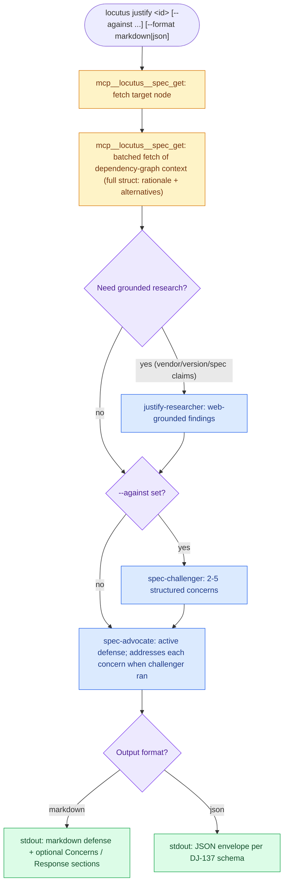

# The Council

Locutus's "council" is the set of specialized agents (`spec-scout`, `spec-decision-elaborator`, etc.) that, taken together, drive a project's spec graph to convergence against `GOALS.md`. Before DJ-135 the council was a Go-coded workflow that Locutus orchestrated in-process. After DJ-135 the same agent set is preserved but the orchestration moves out: the published playbook at `.borg/plans/spec_refinement.md` instructs a coding-agent runtime (Claude Code, Codex, Gemini) to dispatch the agents itself via its own subagent mechanism (Claude Code's Task tool, etc.), calling back into Locutus's MCP server to read and mutate the spec graph.

The agents themselves are unchanged. What changed is who orchestrates them and through what surface. **DJ-136 added a further split:** the playbook is one-iteration-shaped, and the *outer loop* — the "keep running until converged" cadence — is owned by a harness. DJ-136 originally split that harness per runtime (Claude Code's `/goal` evaluator vs Locutus's runner), then **DJ-140 unified the headless path** under `OuterLoopRunner` when `/goal` proved interactive-only, then **DJ-142 filled the empty interactive tier for Codex/Gemini** with a daemon-side self-loop. **DJ-144 then reinstated an in-runtime loop for Claude Code on a new footing** — dynamic workflows, headless-reachable via the keyword trigger — so Claude Code is off `OuterLoopRunner` entirely and the `/goal` wrapper was retired. The matrix now has **four idiomatic convergence drivers reaching one outcome** (converge or stop at `max_iterations`):

- **Headless · Codex / Gemini** → Locutus's `OuterLoopRunner` re-dispatches each iteration and reads the verdict line.
- **Interactive · Codex / Gemini** → the coding agent self-loops in one session, calling the daemon-side loop-state tools `spec_loop_begin` / `spec_loop_status` / `spec_advance_iteration` (the tier-3 `spec_refinement.interactive.md` playbook).
- **Claude Code (both modes)** → an in-runtime dynamic workflow drives the loop and parallel fan-out for the four convergent activities. The tier-2 `<activity>.claude-code.md` playbook contains the word "workflow", which activates Claude Code's dynamic-workflow runner; the script owns the loop and reads the scout's verdict itself. The `{{max_iterations}}` token in the playbook body carries the activity registry's cap, substituted at dispatch.

Across all four, the scout still owns the convergence *judgment*; the drivers differ only in *who re-triggers the next pass* and *who counts iterations against the cap*. The named subagents in this council are unchanged in every cell — DJ-144's workflow script invokes them as workers behind phase barriers, it doesn't absorb their logic.

This document covers:
- The playbook iteration loop, diagrammed
- Per-agent reference: role, output shape, governing DJs
- Convergence-by-construction discipline
- Where to look when a refinement run misbehaves

Authoritative design lives in the [Decision Journal](DECISION_JOURNAL.md). When this doc disagrees with a DJ, the DJ wins.

## The playbook loop

```mermaid
graph TD
    Start(["locutus refine [target] — convergence driver selected by (runtime, mode) (DJ-140/142/144)"]) --> DriverPick{"context?"}

    DriverPick -- "headless · Codex / Gemini" --> RunnerLoop
    DriverPick -- "interactive · Codex / Gemini" --> SelfLoop
    DriverPick -- "Claude Code · both modes" --> WorkflowLoop

    subgraph RunnerLoop ["Driver 1: Locutus outer loop (Codex/Gemini headless — DJ-140)"]
        RunIter["Dispatch one ACP session running spec_refinement.md"]
        RunRead["Read agent's final text"]
        RunEval{"IsConverged()"}
        RunIter --> RunRead --> RunEval
        RunEval -- "converged: true OR cap" --> Done
        RunEval -- "converged: false" --> RunIter
    end

    subgraph SelfLoop ["Driver 2: agent self-loop via loop-state tools (Codex/Gemini interactive — DJ-142)"]
        Begin["spec_loop_begin {activity, target} → iteration, max_iterations"]
        SelfIter["Run one iteration body"]
        Advance["spec_advance_iteration {converged} → continue?"]
        Begin --> SelfIter --> Advance
        Advance -- "continue: false (converged OR cap)" --> Done
        Advance -- "continue: true" --> SelfIter
    end

    subgraph WorkflowLoop ["Driver 3: in-runtime dynamic workflow (Claude Code, both modes — DJ-144)"]
        WfDispatch["Single ACP dispatch (dispatchUsesOuterLoop(claude-code) = false); playbook body contains workflow keyword + {{max_iterations}} token (cap injected at dispatch)"]
        WfIter["Workflow script: run one iteration body (with fan-out across disjoint units behind phase barriers)"]
        WfEval{"scout verdict + script counter ≤ cap?"}
        WfDispatch --> WfIter --> WfEval
        WfEval -- "converged: true OR cap" --> Done
        WfEval -- "converged: false" --> WfIter
    end

    subgraph iter ["Shared iteration body (one run of the per-activity playbook)"]
        CoverageCritic["spec-coverage-critic × P deliverable shapes (parallel) → CoverageReport per shape"]
        Survey["spec-scout: survey + convergence judgement"]
        Surveyed["axes_open · new_nodes · critique_dimensions · concern_dispositions · converged?"]
        CandidateSurveys["spec-candidate-survey × N axes (parallel)"]
        Decisions["spec-decision-elaborator × N axes (parallel) → mcp__locutus__spec_propose_decision"]
        Narratives["spec-feature-elaborator / spec-strategy-elaborator × M new nodes (parallel) → spec_propose_feature / spec_propose_strategy"]
        Critics["spec-critic-elaborator × K dimensions (parallel) → concerns feed next scout"]
        Reconcile["spec-reconciler: cross-decision integrity → mcp__locutus__spec_revise_decision"]
        Verdict["Report verdict: converged: true | converged: false; <reason>"]

        CoverageCritic -- "uncovered_obligations → convergence-blocking input" --> Survey
        Survey --> Surveyed
        Surveyed -- "converged? = true" --> Verdict
        Surveyed -- "converged? = false" --> CandidateSurveys
        CandidateSurveys --> Decisions
        Decisions --> Narratives
        Narratives --> Critics
        Critics --> Reconcile
        Reconcile --> Verdict
    end

    RunIter -. "spawns" .-> iter
    SelfIter -. "spawns" .-> iter
    WfIter -. "spawns" .-> iter

    Done(["Run complete: graph at .borg/spec/; final report on stdout"])

    classDef agent fill:#dbeafe,stroke:#2563eb,color:#1e3a8a
    classDef fanout fill:#fef3c7,stroke:#d97706,color:#78350f
    classDef merge fill:#f3f4f6,stroke:#6b7280,color:#374151
    classDef terminal fill:#dcfce7,stroke:#16a34a,color:#14532d
    classDef harness fill:#ede9fe,stroke:#7c3aed,color:#4c1d95

    class Survey,Reconcile agent
    class CandidateSurveys,Decisions,Narratives,CoverageCritic,Critics fanout
    class Surveyed,Verdict merge
    class Done terminal
    class RunEval,WfEval,Advance,DriverPick harness
```

The shape below mirrors the one-iteration body the orchestrating agent runs. The **outer loop** — deciding whether to dispatch another iteration — is owned by a different driver per context (DJ-140, DJ-142, DJ-144), drawn explicitly below. All four drivers wrap the *same* iteration body and reach the *same* outcome (converge or hit `max_iterations`); they differ only in who re-triggers the next pass. The headless harness reads the iteration's last line (the playbook surfaces a `converged: true` or `converged: false; <reason>` verdict); the interactive Codex/Gemini self-loop reports the verdict to `spec_advance_iteration` and honors its `continue` result; the Claude Code dynamic workflow reads the scout's verdict itself in-script and loops until the script-counted cap.

Each fanout step's parallelism is enabled by the runtime — Claude Code can dispatch multiple subagents concurrently via repeated Task invocations; Codex / Gemini have their own equivalents. The playbook describes the steps as "dispatch in parallel where your runtime allows" rather than mandating concurrency.

The **headless harness drives Codex and Gemini** (DJ-140). The runner's `OuterLoopRunner` calls `runOneIteration` in a Go loop bounded by `max_iterations` (default 20), checking the agent's final text for `converged: true` via `IsConverged`, and re-dispatches a fresh ACP session per iteration. DJ-144 took Claude Code off this path: `dispatchUsesOuterLoop("claude-code") == false`, so Claude Code headless is a single ACP dispatch whose playbook body (the tier-2 `<activity>.claude-code.md`, contains "workflow") activates Claude Code's dynamic-workflow runner — the script owns the loop instead. The `/goal` wrapper that DJ-136 originally relied on was retired entirely under DJ-144 §7 (its file `internal/scaffold/plans/spec_refinement.claude-code.interactive.md` was deleted); the published `/locutus-refine` slash-command body is now the same tier-2 keyword playbook the headless path dispatches.

The **interactive non-Claude driver** (DJ-142) is the tier-3 self-loop. When an operator invokes `/locutus-refine` on Codex or Gemini, the published `spec_refinement.interactive.md` playbook has the coding agent run the loop itself in one session: it calls `spec_loop_begin {activity, target}` once to get the iteration counter + cap, runs the shared iteration body, reports the scout's verdict to `spec_advance_iteration`, and continues while that tool returns `continue: true`. The iteration count + cap are daemon-tracked (deterministic, mirroring the harness), keyed `(ServerSession, activity, target)` — the agent passes only `(activity, target)`, which is re-derivable from run context and so survives a context compression (recovery is re-calling `spec_loop_begin`); the `ServerSession` half disambiguates concurrent coding-agent sessions on the shared per-project daemon. The cap is sourced from the activity registry (DJ-138), uniform across all three drivers. See [docs/runtime-affordances.md](runtime-affordances.md) and [docs/mcp.md](mcp.md) for the loop-state tool reference.

Spec mutation goes exclusively through MCP write tools (`mcp__locutus__spec_propose_*`, `mcp__locutus__spec_revise_decision`). Auto-commit per call: the orchestrating coding agent calls the tool, Locutus commits, and every other attached client receives `notifications/resources/updated` on `spec://manifest`. Multi-client coordination falls out of the singleton daemon model — see `docs/mcp.md` for the lifecycle.

## Agents

Each entry covers role, when the agent runs, output shape (the playbook expects the subagent to return this), and the governing DJs that shaped the agent's prompt content. Model tier, thinking-mode, and grounding fields in the canonical frontmatter still ship for documentation purposes but the coding-agent runtime now decides which model to run — those fields no longer drive a Locutus-side adapter selection.

### `spec-scout`

Gap analyzer, completeness judge, and convergence gate. Runs once on the initial dispatch and once at the tail of every iteration.

| Field | Value |
|---|---|
| Returns | `ScoutBrief`-shaped output: `axes_open`, `new_nodes`, `critique_dimensions`, `concern_dispositions`, `converged` (plus scoping content) |
| Governing DJs | [DJ-124](DECISION_JOURNAL.md#dj-124) (scout-as-judge convergence), [DJ-125](DECISION_JOURNAL.md#dj-125) (concern dispositions), [DJ-129](DECISION_JOURNAL.md#dj-129) (critique-dimension surfacing) |

Four coupled jobs in a single pass:

1. **Survey the domain** — reads GOALS.md + the existing spec snapshot via `mcp__locutus__spec_list_manifest` and `mcp__locutus__spec_get`.
2. **Identify foundational axes** — surfaces axes that need a decision. Each axis the existing graph doesn't already cover becomes an `axes_open[]` entry the next step fans out on.
3. **Identify new spec nodes** — when imported content or goal-shape analysis surfaces a new feature or strategy, emit a `new_nodes[]` entry with pre-populated decision-id references.
4. **Grade open concerns** — from iter 1 onward, every still-`open` critic concern gets a disposition (`addressed` / `wontfix` / `still_open`) with a one-sentence justification.

The `converged` flag drives the playbook's exit condition. True exactly when `axes_open` is empty AND every concern has effective status `stale`/`addressed`/`wontfix`.

### `spec-candidate-survey`

Per-axis enumeration agent that runs before `spec-decision-elaborator` on the initial-elaboration path. One survey call per `axes_open` entry.

| Field | Value |
|---|---|
| Returns | `CandidateList` (flat: name + first_glance_fit per surveyed candidate; ships 6-10 entries for well-trodden axes, 3-5 for specialized ones) |
| Governing DJs | [DJ-132](DECISION_JOURNAL.md#dj-132) (enumeration-vs-judgment separation; per-axis pre-step before the decision-elaborator) |

Per axis: search the candidate space (broad enumeration + constraint-narrowed queries), verify each candidate is real / current / viable, emit a flat list of name + first-glance-fit. **Judgment is the elaborator's job downstream; the survey only enumerates.**

Survey runs **on initial dispatch only**, not on revises (DJ-132 design decision). Revises engage with critic findings + the prior decision's alternatives slice; the survey enumeration would duplicate work.

Grounding (web search) is load-bearing for this agent, not supplementary — DJ-132 documents that training-data-only enumeration produces hallucinated vendors and stale candidates. The canonical frontmatter declares `grounding: true`; coding agents that don't ship a web search tool degrade this agent meaningfully.

### `spec-decision-elaborator`

Authors one decision per axis. Runs in two modes from the same prompt: **first-author** (initial dispatch per `axes_open` entry, with the candidate list from the survey as input) and **revise** (re-dispatch per critic concern under [DJ-126](DECISION_JOURNAL.md#dj-126)).

| Field | Value |
|---|---|
| Returns | A decision body ready to commit via `mcp__locutus__spec_propose_decision` — id, title, summary, status, confidence, rationale, alternatives (each with grounded citations), axes (backfilled from id if omitted), surfaced_by |
| Governing DJs | [DJ-124](DECISION_JOURNAL.md#dj-124) (per-axis dispatch), [DJ-126](DECISION_JOURNAL.md#dj-126) (revise mode), [DJ-128](DECISION_JOURNAL.md#dj-128) (deliberation log + counterproposal discipline), [DJ-132](DECISION_JOURNAL.md#dj-132) (candidate-list-aware initial mode), [DJ-133](DECISION_JOURNAL.md#dj-133) (axis-as-id) |

Per axis: pick a chosen option, justify with grounded citations, and weigh every alternative with grounded `rejected_because` reasoning. The alternatives slice carries the durable deliberation log.

Per DJ-133 the decision's `id` is derived mechanically from the input axis (`dec-` + axis-id verbatim). A revision that flips the chosen option keeps the id stable, so backreferences from features and strategies don't drift. Per DJ-135 ckpt 4 the MCP write tool backfills `axes` from the id when the agent omits it — convergence-by-construction trumps strict-input rigidity.

Revise mode addresses critic concerns with structured counterproposals: either **flips** (counterproposal becomes new chosen; prior chosen demotes to alternatives) or **rejects** (every counterproposal becomes a new alternative with the critic's argument as `rationale`).

### `spec-feature-elaborator`

Authors per-feature narrative — description, acceptance criteria, and the list of decision IDs the feature depends on.

| Field | Value |
|---|---|
| Returns | Feature body for `mcp__locutus__spec_propose_feature` — id, title, summary, status, description, acceptance_criteria, decisions |
| Governing DJs | [DJ-124](DECISION_JOURNAL.md#dj-124) (decisions-before-narrative ordering) |

Narrative elaborators are downstream of decision-elaborators by design. They receive a pre-populated `decisions[]` slice (the scout's decision-mapper pass + this iteration's new decision ids) and author narrative consistent with those decisions' chosen technologies. The feature's `description` names user-visible behavior; cited decisions are referenced by id, not authored or renamed.

### `spec-strategy-elaborator`

Authors per-strategy prose body and decision-id linkage. Structurally similar to the feature elaborator; produces multi-paragraph strategy body instead of feature description + acceptance criteria.

| Field | Value |
|---|---|
| Returns | Strategy body for `mcp__locutus__spec_propose_strategy` — id, title, summary, kind, body, decisions |
| Governing DJs | [DJ-124](DECISION_JOURNAL.md#dj-124) |

Strategy bodies name a specific technology — that's the structural difference from features. A strategy body says "Use Postgres 16 with PostGIS on AWS RDS Multi-AZ"; the cited decisions' chosen options are committed verbatim.

### `spec-coverage-critic`

Deliverable-shape obligation enumerator and coverage judge. Dispatched once per identified deliverable shape at Phase 0 / Step 1 of each iteration, before `spec-scout`, so uncovered obligations feed the scout's convergence judgment on an already-converged graph (DJ-150, amended by DJ-151).

| Field | Value |
|---|---|
| Returns | `CoverageReport` — object with `dispatch_granularity_warning` (optional; set when `shape_id` looks like an in-graph node id rather than a category identifier) and `obligations[]`, an array of `ObligationEntry` (`title, description, source, covered_by: [feat-id, ...], rationale`), one per enumerated category obligation; `source` is `journey` or `grounded`, keying whether the entry carries `journey_provenance: {persona, step}` or `citations[]` |
| Governing DJs | [DJ-150](DECISION_JOURNAL.md#dj-150) (deliverable-shape obligations as refine-time findings; no new graph node kinds), [DJ-151](DECISION_JOURNAL.md#dj-151) (persona journey-walk enumeration + ownership-test coverage judgment) |

Two co-equal enumeration modes feeding one coverage judgment, per dispatch:

1. **Persona journey walk** — derive the deliverable's personas (per-run, not persisted) from the goal layer and feature prose, then walk each through the eight lifecycle stages: arrival/acquisition → authenticate → orient/navigate → core loop → empty/first-run states → failure states → account/workspace management → departure. Every stage the deliverable must support becomes an obligation with `source: journey` and `journey_provenance: {persona, step}` instead of citations — this catches tacit boilerplate (sign-in, nav shell, error states) that no authoritative source bothers to document.
2. **Grounded pass** — enumerate the documented obligations for the shape's category (standards, regulatory regimes, platform/framework guidance), each resolving to at least one authoritative source verified via web search, becoming `source: grounded` with `citations[]`. Unchanged from DJ-150.
3. **Judge coverage — ownership test** — reads feature titles, summaries, and `acceptance_criteria` (new input field per DJ-151); an obligation is covered only when some feature's declared scope claims the obligation's surface as its own deliverable *and* an acceptance criterion exercises it. Ambient mention never counts. An empty `covered_by` means the obligation is uncovered.

Uncovered obligations — journey-derived or grounded alike — flow into the elaborator's revise-pass input alongside the dimension-critic findings. The architect addresses each by extending an existing feature's scope or proposing a new feature via `spec_propose_feature`. The critic does not propose features — that is the architect's job (DJ-150 §1 role boundary).

The `CoverageReport` is session-state only, captured in `.locutus/sessions/<sid>/` but not persisted to `.borg/spec/`. Subsequent runs re-derive both enumeration modes against the (potentially revised) feature set; idempotency follows from persona/lifecycle stability plus grounding stability, not from persisted findings. Multi-deliverable projects get one critic dispatch per identified shape per iteration; feature coverage is judged per-shape (a backend feature does not cover a mobile-app obligation by default).

Frontmatter contract: fast tier across providers, `grounding: true`, `thinking: off`. Grounding is load-bearing for the grounded pass — the critic must verify each cited source at runtime rather than recall from training data. See [DJ-150](DECISION_JOURNAL.md#dj-150) and [DJ-151](DECISION_JOURNAL.md#dj-151) for the full rationale.

### `spec-critic-elaborator`

Dimension-driven critic. One call per `critique_dimensions` entry the scout surfaced this iteration.

| Field | Value |
|---|---|
| Returns | `CriticIssues` — issues list, each with weakness + evidence + counterproposals + related_decision_ids |
| Governing DJs | [DJ-128](DECISION_JOURNAL.md#dj-128) (structured counterproposal menu discipline), [DJ-129](DECISION_JOURNAL.md#dj-129) (dimension-driven critique replacing fixed lens set) |

Each invocation receives one dimension: a `focus_question`, `source_evidence` excerpts, a `disciplines` enum, and a `severity_floor`. Emits one issue per architecturally distinct problem. Each issue carries `counterproposals[]` — an enumerated menu of concrete alternatives the critic would accept in place of the current decision, each with `option` + `argument` + grounded `citations`.

`CritiqueDimensions` themselves come from the scout. Scout-author dimensions are project-shaped — an electoral-campaign project surfaces `voter-file-privacy`; a fintech project surfaces `pci-scope`. The pre-DJ-129 fixed lens set (architect / devops / sre / cost critics) is retired.

### `spec-reconciler`

Cross-decision integrity check. Runs once per iteration near the end of the loop.

| Field | Value |
|---|---|
| Returns | A list of revisions to apply via `mcp__locutus__spec_revise_decision` for any decision that needs cross-graph repair |
| Governing DJs | (pre-DJ-124 integrity-revise architect — repurposed under the new playbook model as an explicit step rather than a backstop) |

Walks the graph for dangling references, axis duplication, contradictory commitments, and emits per-decision revisions where needed. Under the legacy in-process council this was largely a no-op because the merge layer guaranteed integrity; under the new model the runtime's parallel dispatch can produce transient inconsistencies the reconciler catches before the next iteration's scout.

### Retired agents

- **`spec_architect`** (integrity-revise gate) — was a Locutus-side backstop after the council loop converged. The new model has the orchestrating coding agent itself catch integrity at the reconciler step; the standalone architect retired with the workflow that drove it.
- **`spec_gate`, `spec_outliner`, `spec_finding_clusterer`, `spec_summarizer`** — supporting agents that were council-internal. Canonical files still ship for forward compatibility, but no current playbook dispatches them.

## The justify sub-council (DJ-137)

The `locutus justify <id>` verb dispatches its own one-shot activity (`justification`) with a separate playbook and a distinct sub-council. It retired with the rest of the council in DJ-135 phase 5 and was restored under DJ-137 (2026-05-26) using the same agent prompts the council deletion left behind (they sit in `internal/scaffold/agents/` and the publisher emits them to every detected runtime).

The sub-council is **one-shot**, not iterative — no scout, no convergence loop, no outer harness. The orchestrator runs to completion and the verb returns. Read-only on the spec graph (no `spec_propose_*` calls); mistakes are inert.

Per DJ-137's dependency-graph context expansion: the second `spec_get` call is batched (one call, full list of upstream ids) and returns each linked node's **full struct** — `rationale`, `chosen_option`, and the complete `alternatives` slice. Under DJ-133's axis-shaped ids the alternatives slice IS the council's comparative research; the advocate consumes it rather than re-deriving it. A justify run against a strategy or feature WITHOUT this expansion would produce "trust me" defenses with no grounding — an output the operator cannot evaluate.

The agent set the playbook may dispatch:

- **`spec-advocate`** — writes a 2-4 paragraph defense; when a challenger brief is present, responds point-by-point with verdict labels (`held_up` / `partially_held_up` / `broke_down`).
- **`spec-challenger`** — writes 2-5 adversarial concerns against the operator's `--against "..."` text. Each concern names the weakness, evidence, and a counterproposal.
- **`justify-researcher`** — web-grounded fact-finding subagent. Optional; dispatched when the node's claims involve current-vendor / current-spec facts that warrant verification.

Two further agents (`justify-splitter`, `justify-synthesizer`) ship as published prompts for ad-hoc invocation but the v1 playbook does not dispatch them. They were council-era plumbing for per-decision fanout; DJ-137's rich-context expansion replaces fanout as the design pattern.

## Assimilate (DJ-148)

Brownfield code → spec reconciliation. The assimilate playbook runs **code-is-truth** — it surveys the codebase, gathers per-domain evidence (backend/frontend/infrastructure) in parallel via `backend-analyzer` / `frontend-analyzer` / `infra-analyzer` subagents, and reconciles their contributions against the existing manifest with code-is-truth direction. The `gap-analyst` reconciler applies inferred changes via `spec_revise_*` / `spec_propose_*` mutations and synthesizes approaches binding each inferred feature/strategy to its source files via `spec_propose_approach`. Convergence is single-pass-shaped; iteration (bounded by a lower `max_iterations` default of 3) only re-runs on transient failures.

## Adopt (DJ-149)

Spec → code reconciliation. The adopt playbook reads the spec graph and state store, computes a worklist of approaches needing work (unbound / spec-drifted / code-drifted / orphan-parent), and dispatches the runtime to implement them in stacked worktrees. Subagent flow: **drift-classifier** judges per-file code drifts (semantic vs trivial; trivial accepted via `state_refresh_artifacts`); **approach-regenerator** regenerates an approach body when its parent feature/strategy or cited decisions change (output fed to `spec_revise_approach`; runtime then re-implements in fresh worktree on next adopt run). The orchestrator computes the worklist from state, writes plan files to `.locutus/sessions/<sid>/plans/`, dispatches the runtime for stacked-worktree implementation, persists reconciliation via state MCP tools, surfaces drift classification in the report.

## Convergence by construction

Convergence is driven differently per `(runtime, mode)` context, but every driver reaches the same outcome (scout reports `converged: true`, or `max_iterations` cap fires):

| Context | Driver | Convergence judgment | Cap enforcement |
|---|---|---|---|
| Headless · Codex / Gemini | Locutus `OuterLoopRunner` (re-dispatch per iteration) | scout verdict line | harness counter (DJ-138 `max_iterations`) |
| Interactive · Codex / Gemini | agent self-loop via `spec_loop_*` (DJ-142) | scout verdict to `spec_advance_iteration` | daemon counter |
| **Claude Code (both modes)** | **in-runtime dynamic workflow script** (DJ-144) | **scout verdict, read by the script** | **script counter against the `{{max_iterations}}` token injected at dispatch** |

The scout owns the convergence *judgment* in every cell — only the *driver* differs. DJ-144 took Claude Code off the harness outer loop entirely (`dispatchUsesOuterLoop("claude-code") == false`) so the script's loop and the harness's loop don't stack and double-count iterations. The named subagents in this council are unchanged — the workflow script invokes them as workers behind phase barriers (fan out only over disjoint units; barrier before any step that writes a node another branch might also write).

The pre-DJ-135 council frequently failed to converge: critics re-raised the same concerns iteration after iteration, decisions stalled waiting for human review, and the loop timed out without committing anything. The pivot's discipline: **commit, don't defer.**

The spec_refinement playbook's prose enforces this:

- If an axis appears in `axes_open` and the candidate-survey + elaborator produced a defensible answer, commit it. Don't surface "I'm not sure" to the human — that's a deferral.
- If a concern recurs across two iterations with no new evidence, treat it as `wontfix`. Recurring concerns without new evidence are a smell that the critic dimension is mis-scoped, not that the decision is wrong.
- If the 20-iteration cap fires, commit the best-known state and report. Don't loop further.

Coverage-critic findings participate in convergence the same way other findings do, regardless of enumeration mode: the architect's revise pass addresses uncovered obligations — journey-derived or grounded — by extending a feature's scope or proposing a new feature; the next iteration's critic re-runs against the revised feature set and finds those obligations covered under the ownership test (DJ-151). Convergence is reached when `axes_open` is empty, concerns are resolved, and the coverage-critic reports no uncovered obligations.

The MCP write tools reinforce the discipline at the validation layer: `axes` backfills from the id when omitted (per DJ-133), `surfaced_by` is optional, and validation errors that DO fire (id missing, wrong kind prefix, body shape mismatch) name what's wrong specifically so the agent's next attempt can fix it.

## Where to look when a run misbehaves

Sessions land under `.locutus/sessions/<date>/<time>/<sid>/`:

| File | What to look at |
|---|---|
| `playbook.md` | What the agent received as its initial instruction. Confirms the playbook reached the agent intact. |
| `events.jsonl` | Every ACP event observed during the session — agent messages, subagent dispatches, MCP tool calls, errors. One JSON object per line. |
| `tools.jsonl` | Filtered to tool_call / tool_result events. Fast scan for "did the agent ever call `spec_propose_decision`?" or "did `spec_search` return what we expected?" |
| `output.md` | The agent's final text output (concatenated EventText). The summary the playbook asks for at the end. |

Common patterns:

- **Agent never calls `mcp__locutus__spec_*` tools.** Either the MCP server didn't attach (check `.mcp.json` is present + `.locutus/mcp.sock` exists during the run) or the agent went exploratory-first (the playbook's "Start here" section calls this out; adjust if needed).
- **Subagent dispatches return but no `propose_decision` follows.** Check the subagent's returned body in `tools.jsonl` (the Task tool result event) — usually a schema-validation rejection. The MCP tool's error response names the missing field; the agent's next attempt usually fixes it.
- **Loop never reaches `converged: true`.** Check the scout's returned `concern_dispositions` across iterations. Repeated `still_open` on the same concern is the convergence-by-construction failure mode; the playbook says to flip it to `wontfix` after two iterations without new evidence.
- **Run timed out mid-loop.** ACP heavy-grounding fanouts (15+ candidate surveys each doing web searches) can run 10+ minutes. Either increase the timeout, simplify the GOALS.md to reduce axis count, or tune the canonical `spec-candidate-survey` prompt to bound research depth.

See [docs/debugging-traces.md](debugging-traces.md) for the broader operational guide.

## Cross-document references

- **[DECISION_JOURNAL.md](DECISION_JOURNAL.md)** — authoritative design record. DJs cited throughout this doc are the load-bearing source.
- **[agent-conventions.md](agent-conventions.md)** — prompt-author conventions for canonical agents under `internal/scaffold/agents/` and playbooks under `internal/scaffold/plans/`.
- **[mcp.md](mcp.md)** — Locutus's MCP server surface, daemon lifecycle, bridge mechanics, and session-recording shape.
- **[activities.md](activities.md)** — activity registry, agents.yaml schema, runtime detection, publisher behavior, and lifecycle.
- **[debugging-traces.md](debugging-traces.md)** — operational guide for session-trace forensics.
- **[CLAUDE.md](../CLAUDE.md)** — repo-wide guidance and architecture invariants.
